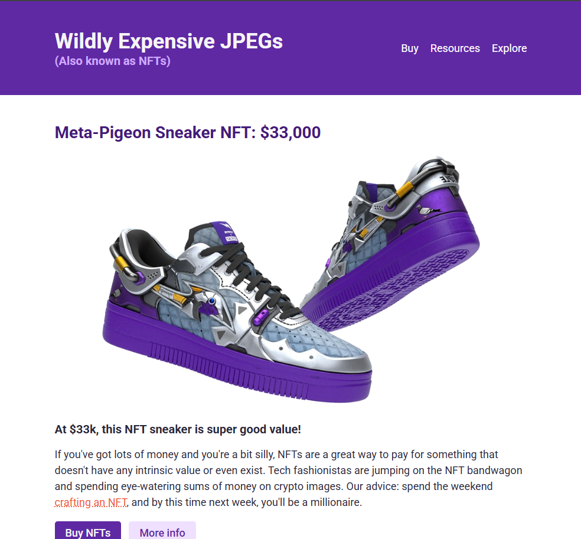

# Wildly Expensive JPEGs (NFT Site)

A satirical landing page for a fictional NFT marketplace that humorously presents overpriced digital assets. This responsive website showcases modern web development practices while poking fun at the NFT craze.

## 🚀 Live Demo

[Visit the live site](https://kvothe1387.github.io/responsive-build-site/)

## 📸 Screenshot



## 🎯 Project Overview

This project is a fully responsive website built with HTML and CSS that presents a humorous take on NFT marketplaces. The site features:

- **Satirical Content**: Playful copy that pokes fun at expensive NFTs
- **Responsive Design**: Optimized for both mobile and desktop viewing
- **Modern Styling**: Clean, professional design with a purple color scheme
- **Interactive Elements**: Hover effects and styled buttons

## 🛠️ Technologies Used

- **HTML5**: Semantic markup structure
- **CSS3**: Modern styling with flexbox and media queries
- **Google Fonts**: Roboto font family for typography
- **Responsive Design**: Mobile-first approach with breakpoints

## 🎨 Features

### Design Elements
- **Color Scheme**: Purple gradient theme with complementary accent colors
- **Typography**: Roboto font family with varied weights and sizes
- **Layout**: Flexible container system with max-width constraints
- **Interactive Buttons**: Multiple button styles with hover effects

### Responsive Behavior
- **Mobile (≤768px)**: Centered layout with stacked navigation
- **Desktop (≥768px)**: Horizontal navigation with side-by-side content sections
- **Flexible Images**: Responsive images that scale with viewport

### Content Sections
1. **Header**: Site title with navigation menu
2. **Hero Section**: Featured NFT with pricing and call-to-action buttons
3. **Gallery Section**: Featured expensive NFTs with descriptions
4. **Footer**: Simple copyright information

## 📱 Responsive Features

- Mobile-first CSS approach
- Flexible navigation that stacks on mobile devices
- Scalable images and typography
- Touch-friendly button sizes
- Optimized spacing for different screen sizes

## 🗂️ File Structure

```
responsive-build-site/
├── index.html          # Main HTML file
├── index.css           # Stylesheet
├── README.md           # This file
├── screenshot.png      # Site screenshot (placeholder)
└── images/             # Image assets
    ├── sneakers-purple.png
    ├── crypto-punk.jpg
    └── bag.svg
```

## 🚀 Getting Started

### Prerequisites
- A modern web browser
- Basic understanding of HTML/CSS (for customization)

### Installation
1. Clone the repository:
   ```bash
   git clone https://github.com/kvothe1387/responsive-build-site.git
   ```

2. Navigate to the project directory:
   ```bash
   cd responsive-build-site
   ```

3. Open `index.html` in your web browser or serve it using a local server.

### Local Development
For local development, you can use any static file server. For example:

```bash
# Using Python (Python 3)
python -m http.server 8000

# Using Node.js (with http-server package)
npx http-server

# Using PHP
php -S localhost:8000
```

## 🎯 Key CSS Techniques Demonstrated

- **Flexbox Layouts**: Modern layout system for responsive design
- **CSS Custom Properties**: Consistent color scheme management
- **Media Queries**: Responsive breakpoints for different screen sizes
- **Typography Scaling**: Fluid typography that adapts to screen size
- **Hover Effects**: Interactive button and link states
- **Mobile-First Design**: Progressive enhancement from mobile to desktop

## 🔧 Customization

### Typography
The site uses Google Fonts (Roboto) with multiple weights. Font sizes are responsive and scale with screen size.

### Layout
The responsive layout uses a container system with:
- Mobile: 90% width with center alignment
- Desktop: Fixed max-width of 800px

## 📄 License

This project is open source and available under the [MIT License](LICENSE).

## 🤝 Contributing

Contributions, issues, and feature requests are welcome! Feel free to check the [issues page](https://github.com/kvothe1387/responsive-build-site/issues).

## 👨‍💻 Author

**kvothe1387**
- GitHub: [@kvothe1387](https://github.com/kvothe1387)

## 🙏 Acknowledgments

- Google Fonts for the Roboto font family
- The NFT community for providing endless inspiration for satirical content
- The web development community for responsive design best practices

---

*Note: This is a satirical website created for educational purposes. No actual NFTs are being sold.*